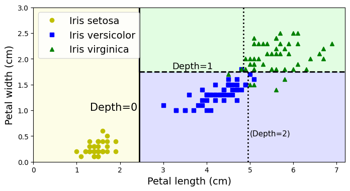
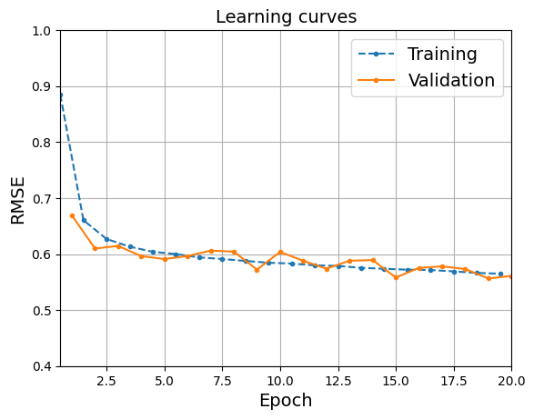

<p align="center">
  
</p>

# Hands-On Machine Learning

A practical study notebook exploring the machine learning workflow: understand the data, prepare features, train models, evaluate predictions, and build neural networks with PyTorch.

[](https://colab.research.google.com/github/AgentQ1/HandsOnMachineLearning.ipynb/blob/main/HandsOnMachineLearning.ipynb)

**[Browse the notebook](HandsOnMachineLearning.ipynb)** · **[Topic guide](docs/NOTEBOOK_GUIDE.md)** · **[Getting started](docs/GETTING_STARTED.md)**

## Explore the topics

Follow the topics in order, or use **Open section** to jump to a chapter in Colab. For execution, start with the chapter's setup cells; later examples reuse earlier variables.

| | Topic | What you'll find | Jump in |
| :--- | :--- | :--- | :--- |
| **01** | **End-to-end ML project** | California housing, exploratory plots, preprocessing pipelines, cross-validation, model tuning | [Open section](https://colab.research.google.com/github/AgentQ1/HandsOnMachineLearning.ipynb/blob/main/HandsOnMachineLearning.ipynb#scrollTo=Ha7F9sFme49U) |
| **02** | **Classification** | MNIST, precision and recall, ROC curves, multiclass and multilabel models, KNN | [Open section](https://colab.research.google.com/github/AgentQ1/HandsOnMachineLearning.ipynb/blob/main/HandsOnMachineLearning.ipynb#scrollTo=QquaoL3ut1ZQ) |
| **03** | **Linear models** | The normal equation, least squares, and linear regression with scikit-learn | [Open section](https://colab.research.google.com/github/AgentQ1/HandsOnMachineLearning.ipynb/blob/main/HandsOnMachineLearning.ipynb#scrollTo=5GlGHQBQTsFs) |
| **04** | **Decision trees** | Iris classification, decision boundaries, regularization, regression, and variance | [Open section](https://colab.research.google.com/github/AgentQ1/HandsOnMachineLearning.ipynb/blob/main/HandsOnMachineLearning.ipynb#scrollTo=TUfjgfuQrTU9) |
| **05** | **Neural networks with PyTorch** | Tensors, autograd, linear regression, MLPs, DataLoaders, and model evaluation | [Open section](https://colab.research.google.com/github/AgentQ1/HandsOnMachineLearning.ipynb/blob/main/HandsOnMachineLearning.ipynb#scrollTo=STAGa9Ea7urp) |

For individual subtopics, see the [detailed notebook guide](docs/NOTEBOOK_GUIDE.md).

## A look inside

These figures are taken directly from the notebook's saved outputs.

<table>
  <tr>
    <th width="50%">Decision boundaries</th>
    <th width="50%">Neural network learning curves</th>
  </tr>
  <tr>
    <td></td>
    <td></td>
  </tr>
  <tr>
    <td>See how a decision tree partitions the feature space.</td>
    <td>Compare training and validation error over time.</td>
  </tr>
</table>

## Start reading or experimenting

1. **Read:** open the [notebook on GitHub](HandsOnMachineLearning.ipynb) to inspect code and saved results.
2. **Experiment:** [open it in Colab](https://colab.research.google.com/github/AgentQ1/HandsOnMachineLearning.ipynb/blob/main/HandsOnMachineLearning.ipynb), save your own copy, and run the setup cells before the examples.
3. **Work locally:** follow the [environment and dataset notes](docs/GETTING_STARTED.md).

**Tools used:** Python · NumPy · pandas · Matplotlib · SciPy · scikit-learn · PyTorch · TorchMetrics

This is a learning notebook with saved experiments. The navigation update preserves the existing code and outputs; a fresh, complete execution has not been validated. See [execution notes](docs/GETTING_STARTED.md#execution-notes) for version and runtime details.

## Repository map

```text
.
├── HandsOnMachineLearning.ipynb   # Complete notebook with an internal contents page
├── README.md                     # Project overview and quick navigation
├── docs/
│   ├── NOTEBOOK_GUIDE.md          # Chapter and subtopic links
│   └── GETTING_STARTED.md         # Colab, local setup, and data notes
├── assets/                       # README banner and saved notebook figures
├── .gitignore                    # Local environments and generated files
└── LICENSE
```

## Sources and credits

Maintained by [Chandan Kumar](https://github.com/AgentQ1) as a personal learning repository following Aurélien Géron's *Hands-On Machine Learning* examples. The upstream [scikit-learn/TensorFlow notebooks](https://github.com/ageron/handson-ml) and [scikit-learn/PyTorch notebooks](https://github.com/ageron/handson-mlp) provide the reference material.

The [original Colab notebook](https://colab.research.google.com/drive/1O-MGgO1TApDp9EopLio9cWK4Vl9gnq93) is the source of this GitHub copy. Edits here do not automatically synchronize back to Drive.

See [LICENSE](LICENSE) for this repository's license. Referenced materials and datasets retain their respective licenses.
